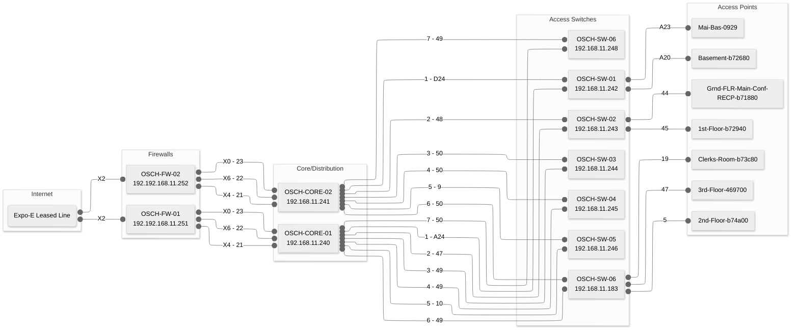

```mermaid
---
---
config:
  theme: neutral
  look: neo
  layout: elk
---
flowchart RL
 subgraph Internet["Internet"]
        Juniper("Expo-E Leased Line")
  end
 subgraph Firewalls["Firewalls"]
        OSCH-FW-01["OSCH-FW-01 <br> 192.192.168.11.251"]
        OSCH-FW-02["OSCH-FW-02 <br> 192.192.168.11.252"]
  end
 subgraph s1["Core/Distribution"]
        OSCH-CORE-01["OSCH-CORE-01 <br> 192.168.11.240"]
        OSCH-CORE-02["OSCH-CORE-02 <br> 192.168.11.241"]
  end
 subgraph subGraph3["Access Switches"]
        OSCH-SW-01["OSCH-SW-01 <br> 192.168.11.242"]
        OSCH-SW-02["OSCH-SW-02 <br> 192.168.11.243"]
        OSCH-SW-03["OSCH-SW-03 <br> 192.168.11.244"]
        OSCH-SW-04["OSCH-SW-04 <br> 192.168.11.245"]
        OSCH-SW-05["OSCH-SW-05 <br> 192.168.11.246"]
        OSCH-SW-06["OSCH-SW-06 <br> 192.168.11.183"]
        OSCH-SW-07["OSCH-SW-06 <br> 192.168.11.248"]
  end
 subgraph subGraph4["Access Points"]
        Basement-b72680["Basement-b72680"]
        Mai-Bas-0929["Mai-Bas-0929"]
        1st-Floor-b72940["1st-Floor-b72940"]
        Grnd-FLR-Main-Conf-RECP-b71880["Grnd-FLR-Main-Conf-RECP-b71880"]
        2nd-Floor-b74a00["2nd-Floor-b74a00"]
        3rd-Floor-469700["3rd-Floor-469700"]
        Clerks-Room-b73c80["Clerks-Room-b73c80"]
  end
    OSCH-FW-01 o-- X2 --o Juniper
    OSCH-FW-02 o-- X2 --o Juniper
    OSCH-CORE-01 o-- "X4 - 21" ---o OSCH-FW-01
    OSCH-CORE-01 o-- "X6 - 22" ---o OSCH-FW-01
    OSCH-CORE-01 o-- "X0 - 23" ---o OSCH-FW-01
    OSCH-CORE-02 o-- "X4 - 21" ---o OSCH-FW-02
    OSCH-CORE-02 o-- "X6 - 22" ---o OSCH-FW-02
    OSCH-CORE-02 o-- "X0 - 23" ---o OSCH-FW-02
    OSCH-SW-01 o-- "1 - A24" ---o OSCH-CORE-01
    OSCH-SW-01 o-- "1 - D24" ---o OSCH-CORE-02
    OSCH-SW-02 o-- "2 - 47" ---o OSCH-CORE-01
    OSCH-SW-02 o-- "2 - 48" ---o OSCH-CORE-02
    OSCH-SW-03 o-- "3 - 49" ---o OSCH-CORE-01
    OSCH-SW-03 o-- "3 - 50" ---o OSCH-CORE-02
    OSCH-SW-04 o-- "4 - 49" ---o OSCH-CORE-01
    OSCH-SW-04 o-- "4 - 50" ---o OSCH-CORE-02
    OSCH-SW-05 o-- "5 - 10" ---o OSCH-CORE-01
    OSCH-SW-05 o-- "5 - 9" ---o OSCH-CORE-02
    OSCH-SW-06 o-- "6 - 49" ---o OSCH-CORE-01
    OSCH-SW-06 o-- "6 - 50" ---o OSCH-CORE-02
    OSCH-SW-07 o-- "7 - 50" ---o OSCH-CORE-01
    OSCH-SW-07 o-- "7 - 49" ---o OSCH-CORE-02
    Basement-b72680 o-- A20 --o OSCH-SW-01
    Mai-Bas-0929 o-- A23 --o OSCH-SW-01
    1st-Floor-b72940 o-- 45 --o OSCH-SW-02
    Grnd-FLR-Main-Conf-RECP-b71880 o-- 44 --o OSCH-SW-02
    2nd-Floor-b74a00 o-- 5 --o OSCH-SW-06
    3rd-Floor-469700 o-- 47 --o OSCH-SW-06
    Clerks-Room-b73c80 o-- 19 --o OSCH-SW-06


```